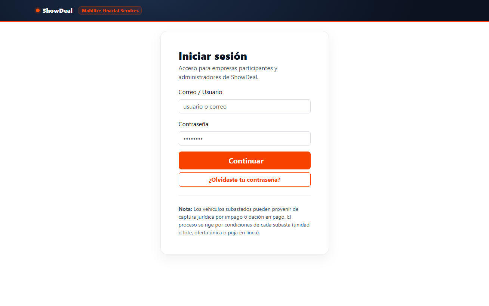
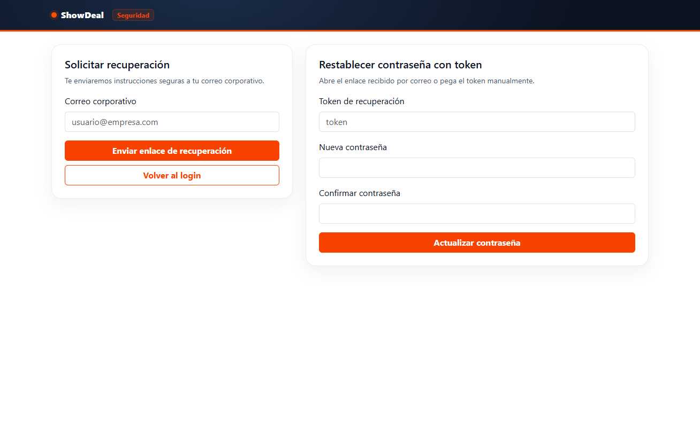
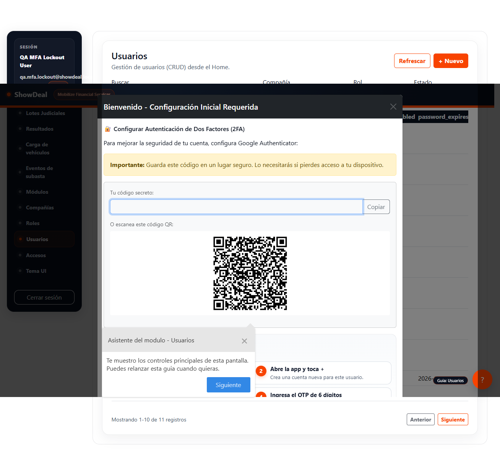
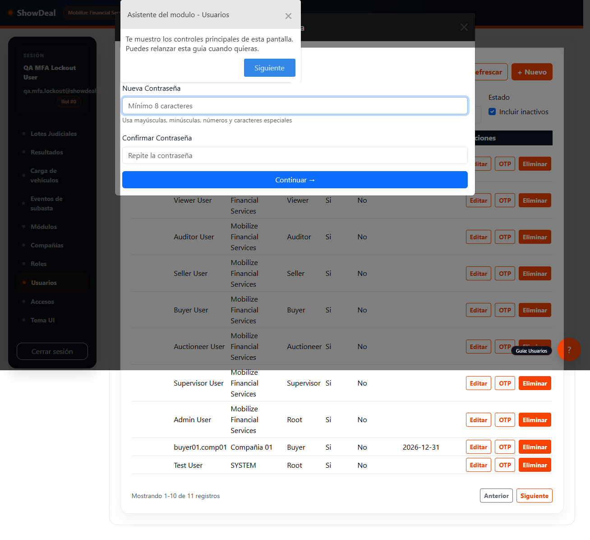
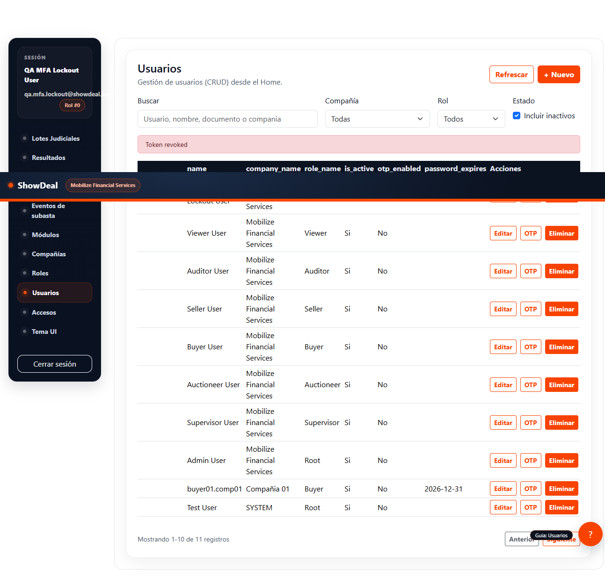
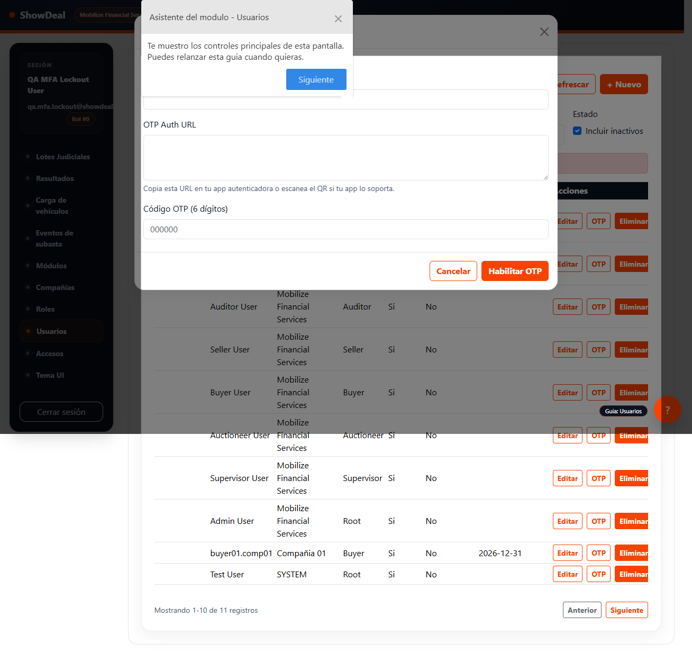
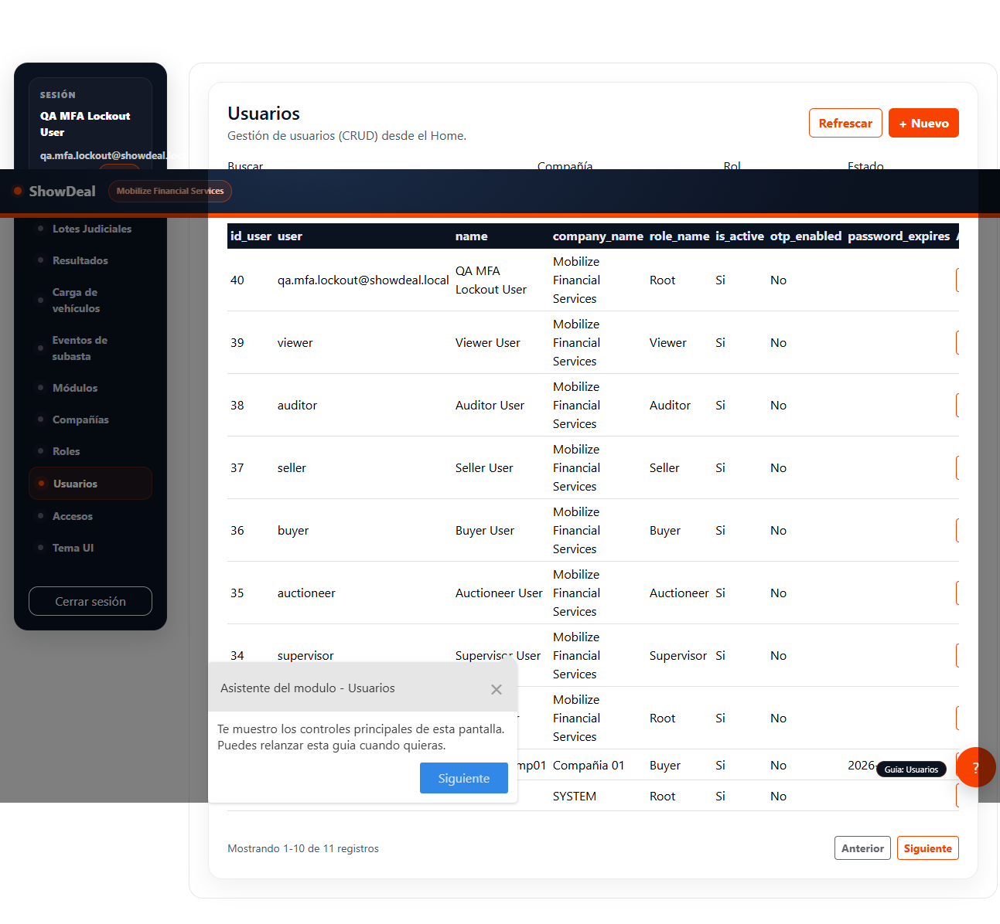
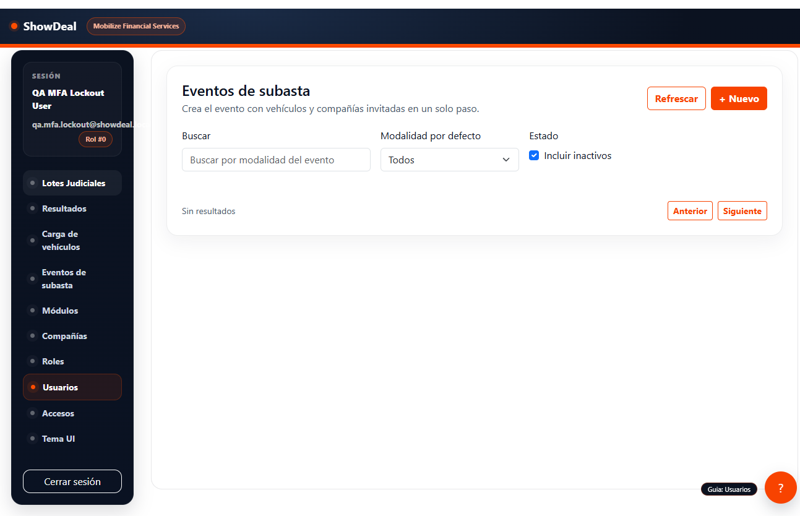
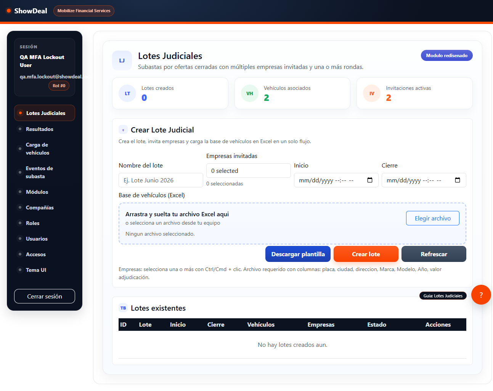

<!-- ============================================================
     SHOWDEAL · MANUAL DE FUNCIONALIDAD
     Versión 1.0 · Junio 2026
     ============================================================ -->

<div align="center">

# 🏛️ ShowDeal — Manual de Funcionalidad

**Plataforma de subastas judiciales y comerciales**

---

| Campo | Detalle |
|---|---|
| **Versión** | 1.0 |
| **Fecha** | 18 de junio de 2026 |
| **Entorno** | `http://localhost:3001` |
| **Perfil validado** | Administrador QA |
| **Estado** | ✅ Validado en producción local |

</div>

---

## 📋 Tabla de contenido

| # | Flujo | Estado |
|---|---|---|
| 1 | [Acceso público — Login](#1-acceso-público--login) | ✅ |
| 2 | [Recuperación de contraseña](#2-recuperación-de-contraseña) | ✅ |
| 3 | [Primer ingreso y onboarding de seguridad](#3-primer-ingreso-y-onboarding-de-seguridad) | ✅ |
| 4 | [Gestión de usuarios](#4-gestión-de-usuarios) | ✅ |
| 5 | [Administración OTP por usuario](#5-administración-otp-por-usuario) | ✅ |
| 6 | [Restablecimiento completo de contraseña](#6-restablecimiento-completo-de-contraseña) | ✅ |
| 7 | [Eventos de subasta](#7-eventos-de-subasta) | ✅ |
| 8 | [Lotes judiciales](#8-lotes-judiciales) | ✅ |
| 9 | [Referencia de seguridad](#9-referencia-de-seguridad) | ✅ |

---

## 1. Acceso público — Login

> **Punto de entrada único** para todos los perfiles. Soporta autenticación con correo/contraseña y segunda factor OTP cuando está habilitado.


*Figura 1 — Pantalla de ingreso*

### 🔑 Campos disponibles

| Campo | Tipo | Validación |
|---|---|---|
| Usuario / correo | Texto | Requerido, formato email |
| Contraseña | Password | Requerido, min 8 caracteres |
| Recordarme | Checkbox | Sesión extendida |

### ⚠️ Comportamiento de seguridad

| Evento | Respuesta del sistema |
|---|---|
| 1–2 intentos fallidos | Mensaje de credenciales inválidas |
| 3er intento fallido | Cuenta bloqueada temporalmente |
| Cuenta bloqueada | Código `423 ACCOUNT_LOCKED`, tiempo de espera visible |
| Contraseña vencida | Redirige a cambio obligatorio |

> 💡 **Tip:** El enlace **¿Olvidaste tu contraseña?** está debajo del formulario y lleva directamente al flujo de recuperación.

---

## 2. Recuperación de contraseña

> El flujo de recuperación es **sin contraseña**: el usuario solicita un enlace por correo, recibe el token y define su nueva contraseña.


*Figura 2 — Vista de recuperación de contraseña*

### 🔄 Flujo paso a paso

```
Usuario ingresa correo
        │
        ▼
Sistema genera token de un solo uso (SHA-256, 1 hora TTL)
        │
        ▼
Correo enviado con enlace /?token=<hash>
        │
        ▼
Usuario ingresa token + nueva contraseña
        │
        ▼
✅ Contraseña actualizada  →  Redirige al login
```

### Controles del formulario

| Paso | Campo | Descripción |
|---|---|---|
| **Paso 1** | Correo electrónico | Para solicitar el token |
| **Paso 2** | Token de recuperación | Desde el correo o vía QA script |
| **Paso 2** | Nueva contraseña | Min 8 caracteres, al menos una mayúscula y un número |
| **Paso 2** | Confirmar contraseña | Debe coincidir |

> ✅ **Resultado validado:** después del reset exitoso, el sistema invalida el token y redirige al login con el mensaje *"Password has been reset successfully."*

---

## 3. Primer ingreso y onboarding de seguridad

> Cuando un usuario accede por primera vez (flag `first_login = true`), la plataforma ejecuta un flujo guiado de hardening antes de dar acceso completo.

### 3.1 Pantalla de bienvenida con tour guiado


*Figura 3 — Home en primer ingreso con asistente de seguridad activo*

### 3.2 Cambio obligatorio de contraseña

Antes de continuar, el sistema requiere que el usuario reemplace la contraseña temporal.


*Figura 4 — Modal de cambio obligatorio de contraseña*

### 🛡️ Secuencia de onboarding

```
Primer login exitoso
        │
        ├── Tour guiado Shepherd activo
        │
        ├── [1] Cambio obligatorio de contraseña
        │         └── Valida fortaleza, actualiza credencial activa
        │
        ├── [2] Configuración OTP / 2FA (opcional pero recomendado)
        │         └── QR + código de verificación
        │
        └── ✅ Acceso completo al Home
```

> ⚠️ **Nota técnica:** el cambio de contraseña en el primer ingreso invalida el JWT de sesión actual. El usuario debe reingresar con la nueva contraseña. Esto es comportamiento correcto e intencional.

---

## 4. Gestión de usuarios

> Módulo administrativo central para crear, editar, y controlar el acceso de todos los usuarios de la plataforma.


*Figura 5 — Módulo Usuarios (vista limpia sin tour)*

### 🔍 Capacidades del módulo

| Función | Descripción |
|---|---|
| **Buscar** | Por usuario, nombre o compañía en tiempo real |
| **Filtrar por compañía** | Dropdown con todas las compañías activas |
| **Filtrar por rol** | Dropdown con roles disponibles |
| **Mostrar inactivos** | Toggle para incluir usuarios desactivados |
| **Crear usuario** | Modal con formulario completo |
| **Editar** | Modal con datos precargados |
| **Eliminar** | Confirmación antes de borrar |
| **Gestionar OTP** | Modal dedicado por usuario |

### 🏷️ Campos del formulario de usuario

| Campo | Tipo | Requerido |
|---|---|---|
| Login (correo) | Email | ✅ |
| Nombre completo | Texto | ✅ |
| Compañía | Select | ✅ |
| Rol | Select | ✅ |
| Contraseña inicial | Password | ✅ en creación |
| Activo | Toggle | — |

---

## 5. Administración OTP por usuario

> Cada usuario puede tener OTP habilitado individualmente. El administrador gestiona el ciclo completo desde el módulo de usuarios.


*Figura 6 — Modal de OTP mostrando estado tras cambio de contraseña*

### 🔐 Estados posibles del OTP

| Estado | Descripción | Acción disponible |
|---|---|---|
| `No configurado` | Usuario sin OTP | Habilitar |
| `Configurado / Activo` | OTP operativo | Deshabilitar / Regenerar |
| `Sesión revocada` | Token invalidado por cambio de contraseña | El usuario debe reautenticarse |

> 💡 **Validado:** cuando el usuario cambia su contraseña, el token JWT activo queda inmediatamente inválido. La siguiente acción del usuario genera un error `401` que lo redirige al login. Comportamiento correcto por diseño.

### 📱 Flujo de activación OTP

```
Admin abre modal OTP para el usuario
        │
        ▼
Sistema genera secreto TOTP
        │
        ▼
Se muestra QR + clave manual
        │
        ▼
Usuario escanea con app (Google Authenticator, Authy, etc.)
        │
        ▼
Usuario ingresa código de 6 dígitos para confirmar
        │
        ▼
✅ OTP habilitado — exigido en próximo login
```

---

## 6. Restablecimiento completo de contraseña

> Flujo validado extremo a extremo usando el usuario QA y un token generado con el script utilitario.

### Paso 1 — Formulario de reset con token


*Figura 7 — Formulario de restablecimiento con token y nueva contraseña*

### Paso 2 — Home tras reset exitoso


*Figura 8 — Acceso exitoso después del restablecimiento*

### ✅ Checklist de validación ejecutada

- [x] Token generado con `generate-qa-reset-token.js`
- [x] Token ingresado en el formulario de reset
- [x] Nueva contraseña aceptada
- [x] Mensaje de confirmación visible: *"Password has been reset successfully."*
- [x] Login con nueva contraseña exitoso
- [x] Bloqueo de cuenta limpiado automáticamente en reset
- [x] Versión de token actualizada (sesiones previas inválidas)

---

## 7. Eventos de subasta

> Módulo para administrar eventos de subasta: crear, asociar activos, invitar compañías y controlar el ciclo de vida.


*Figura 9 — Módulo Eventos de subasta*

### 📋 Capacidades del módulo

| Función | Descripción |
|---|---|
| **Crear evento** | Define nombre, modalidad, fecha inicio/cierre |
| **Filtrar por modalidad** | Online, presencial, mixto |
| **Mostrar vencidos** | Toggle para eventos cerrados |
| **Vehículos** | Asociar activos al evento |
| **Compañías** | Invitar compañías al evento |
| **Editar** | Modificar datos del evento |
| **Eliminar** | Con confirmación |

### 🏷️ Modalidades de subasta disponibles

| Modalidad | Descripción |
|---|---|
| **Pública** | Visible para todos |
| **Por invitación** | Solo compañías invitadas |
| **Sellada** | Ofertas ciegas, una sola oferta por empresa |
| **Judicial** | Vinculada a proceso legal |

---

## 8. Lotes judiciales

> Módulo rediseñado orientado a operación judicial con carga masiva de vehículos y control por empresa.


*Figura 10 — Módulo Lotes Judiciales*

### 🗂️ Capacidades del módulo

| Función | Descripción |
|---|---|
| **Crear lote** | Define nombre, juzgado, radicado, fechas |
| **Empresas invitadas** | Multi-select de compañías participantes |
| **Carga Excel** | Subida masiva de vehículos con plantilla predefinida |
| **Plantilla** | Descarga la plantilla Excel con estructura esperada |
| **Inicio / Cierre** | Ventana de tiempo para recepción de ofertas |
| **Tabla de lotes** | Lista existentes con estado y acciones |

### 📊 Flujo de operación de un lote

```
Crear lote (nombre, juzgado, radicado)
        │
        ├── Seleccionar empresas invitadas
        │
        ├── Definir ventana de tiempo (inicio → cierre)
        │
        ├── Descargar plantilla Excel
        │         └── Completar vehículos con datos requeridos
        │
        ├── Cargar Excel → sistema valida y registra vehículos
        │
        └── ✅ Lote activo — empresas pueden enviar ofertas
```

> 💡 **Nota:** el sistema valida que la ventana de tiempo esté abierta antes de aceptar ofertas. Intentos fuera de ventana retornan `EVENT_NOT_ACTIVE`.

---

## 9. Referencia de seguridad

### 🔒 Características de seguridad implementadas

| Característica | Estado | Detalles |
|---|---|---|
| Autenticación JWT | ✅ | HS256, expiración configurable |
| Segundo factor OTP / TOTP | ✅ | Compatible con Google Authenticator, Authy |
| Bloqueo por intentos fallidos | ✅ | 3 intentos → bloqueo temporal |
| Desbloqueo por reset de contraseña | ✅ | Reset limpia el bloqueo automáticamente |
| Invalidación de token por rotación | ✅ | `tokenVersion` incrementa en cada cambio |
| Cambio obligatorio en primer ingreso | ✅ | Flag `first_login` controla el flujo |
| Tokens de recuperación de un solo uso | ✅ | SHA-256, TTL 1 hora, borrado tras uso |
| CSRF protection | ✅ | Token en cookie + header sincronizado |
| Rate limiting | ✅ | Por IP en endpoints de autenticación |
| Validación de entrada con Zod | ✅ | En todos los endpoints de API |

### 🛠️ Scripts de operación QA

| Script | Propósito |
|---|---|
| `App/scripts/create-test-user.js` | Crea / resetea usuario QA con `first_login: true` |
| `App/scripts/generate-qa-reset-token.js` | Genera token de recuperación para pruebas |
| `App/scripts/lint-frontend-security.js` | Verifica interpolaciones inseguras en frontend |

### 🧪 Pruebas automatizadas

| Archivo | Cobertura |
|---|---|
| `tests/auth.lockout.test.js` | Bloqueo en 3er intento, respuesta `423` |
| `tests/auth.service.test.js` | Login, OTP, cambio de contraseña |
| `tests/common.utils.test.js` | Selección de credencial vigente |
| `tests/frontend-security-lint.test.js` | Lint de interpolaciones XSS |

---

## 📝 Pendiente para próxima versión del manual

| Módulo / Flujo | Tipo |
|---|---|
| Módulo Compañías | Screenshot + descripción |
| Módulo Roles y Accesos | Screenshot + descripción |
| Flujo comprador (perfil no admin) | Walkthrough completo |
| OTP — activación paso a paso con QR | Captura del QR y código |
| Subastas en vivo — flujo de puja | Captura de módulo `r_bid` |
| Panel de reportes | Si disponible |

---

<div align="center">

*ShowDeal · Manual de Funcionalidad v1.0 · Junio 2026*

</div>
